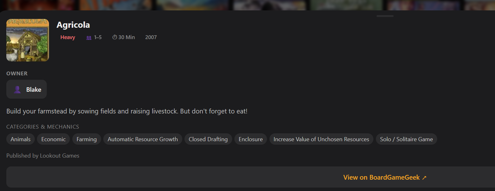
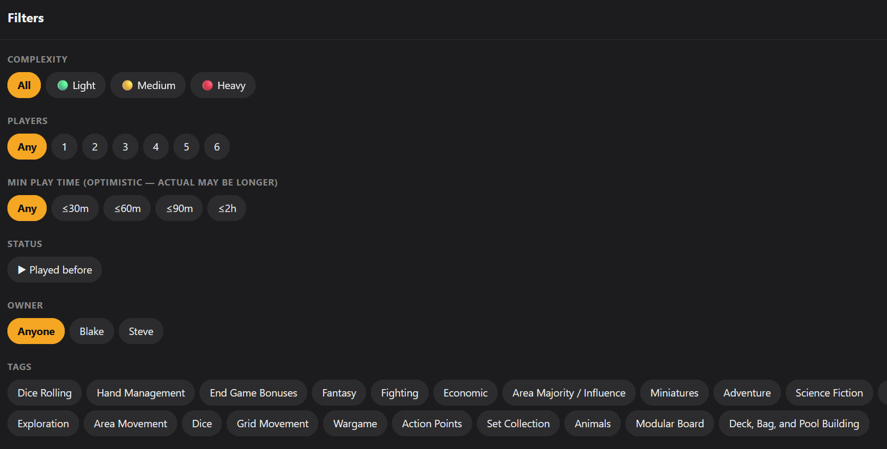
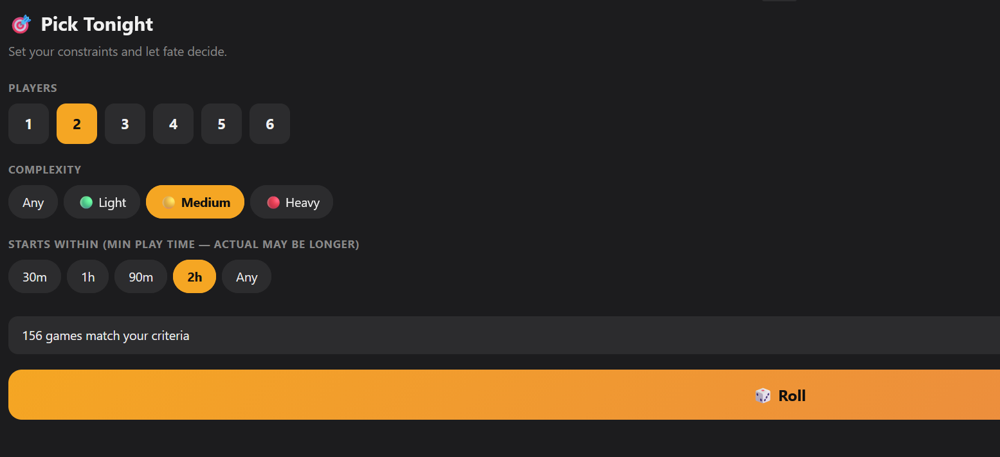

# 🎲 Board Game Browser

A beautiful, filterable board game collection browser built with OpenClaw.

---

## What is this?

A personal board game catalog that lives on the web. See all your games at a glance, filter by complexity/player count/play time, search with instant results, and roll the dice to pick tonight's game. Built for people who collect games and actually want to *use* them.

---

## How to Build Your Own

### 1. **Set up the database**

Create a file at `~/.openclaw/apps/boardgame-picker/games.jsonl` with your game collection. Each line is one game (JSON):

```json
{"game_id": "heat-pedal-to-the-metal", "name": "Heat: Pedal to the Metal", "owner": "Blake", "bgg_id": 366013, "yearpublished": 2022, "minplayers": 1, "maxplayers": 6, "minplaytime": 30, "maxplaytime": 60, "weight": "medium", "tags": ["Racing", "Sports"], "publisher": "Days of Wonder"}
```

**Key fields:**
- `game_id` - URL-safe slug (auto-generated from name)
- `name` - Game title
- `owner` - Who owns it (e.g., "Blake", "Steve")
- `bgg_id` - BoardGameGeek ID (for linking to BGG)
- `weight` - "light", "medium", or "heavy"
- Everything else is optional but makes the app more useful

**Tip:** Export your collection from BoardGameGeek (Geek > Geeklist > Export) and use the `bgg-enrichment` skill to fetch metadata.

### 2. **Clone the app**

```bash
git clone <repo-url> boardgame-browser
cd boardgame-browser
npm install
```

### 3. **Build it**

```bash
npm run build
```

This creates a static website in the `out/` folder—no server needed.

### 4. **Deploy to Cloudflare Pages**

1. Push to GitHub
2. Connect your repo to [Cloudflare Pages](https://pages.cloudflare.com/)
3. Set build command: `npm run build`
4. Set publish directory: `out`
5. Every `git push` auto-deploys your app

**With a custom domain:**
- Point DNS to Cloudflare
- Cloudflare Pages handles HTTPS automatically
- No server, no uptime worries, ~free

**Optional: Password gate**
- Use [Cloudflare Access](https://developers.cloudflare.com/cloudflare-one/applications/configure-apps/self-hosted-apps/) to add login
- Protects your site from public access

---

## How to Use It with OpenClaw

Once deployed, you can manage your collection via OpenClaw:

### Add a game
```
Add Heat: Pedal to the Metal to Blake's collection
```
OpenClaw uses the `boardgame-picker` skill to:
- Fetch metadata from BoardGameGeek
- Generate a game entry
- Write to `games.jsonl`
- Rebuild + deploy automatically

### Update a game
```
Set Heat's rating to 9.5 and add "competitive" tag
```

### Filter & search
The browser does all the UI work—just click, drag, and play.

---

## What Makes This Cool

✨ **No server maintenance** — Cloudflare Pages is literally free after a point  
✨ **Data stays local** — `games.jsonl` lives in your workspace, you own it  
✨ **Auto-deploy** — Push to GitHub, site updates in ~5 minutes  
✨ **Dead simple UI** — Responsive grid, dark theme, instant search  
✨ **Pick Tonight feature** — Roll the dice when you can't decide  
✨ **Offline-friendly** — Static HTML, works on slow connections  

---

## Want to Extend It?

- Add a wishlist view
- Sync with multiple people's collections
- Play statistics over time
- Integration with your actual calendar ("games for 4 players next Saturday?")

It's all yours to modify. Just edit the code, push to GitHub, and the site updates automatically.

---

**Made with OpenClaw + BoardGameGeek data + Cloudflare Pages** ⚡


## Screenshots

### Game Card


### Filters


### Pick Tonight

